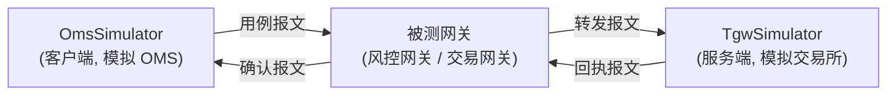
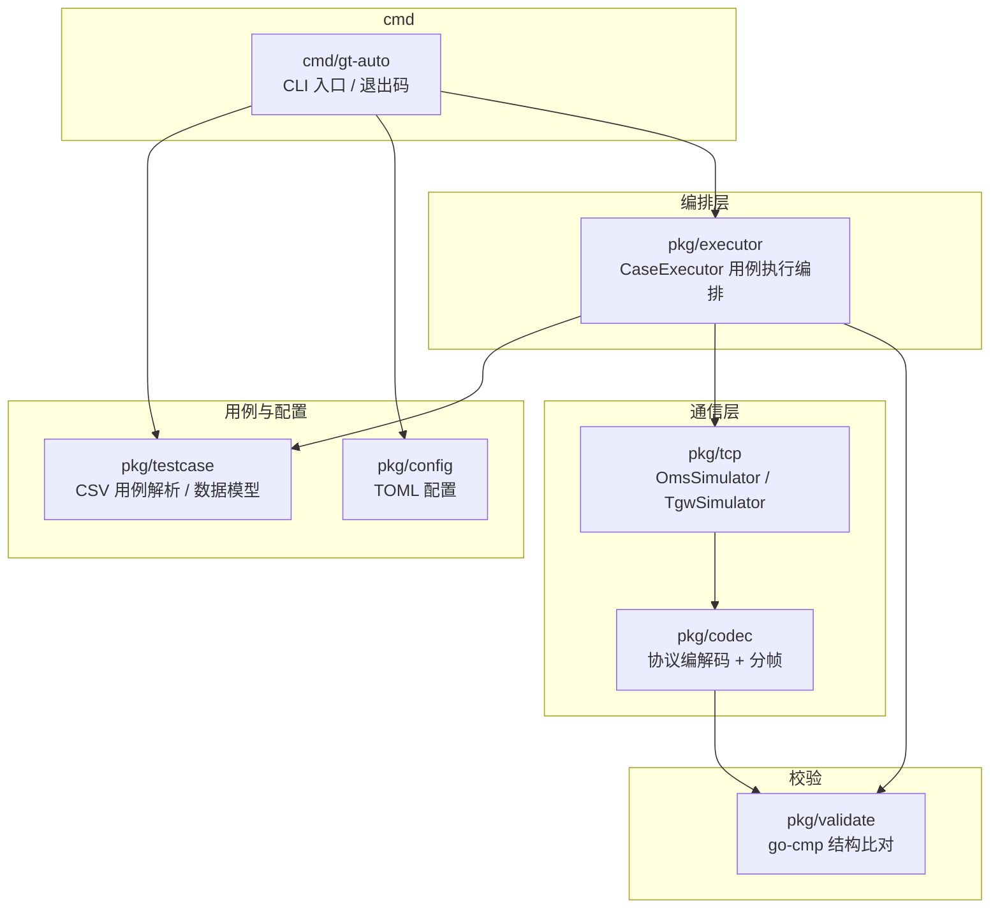
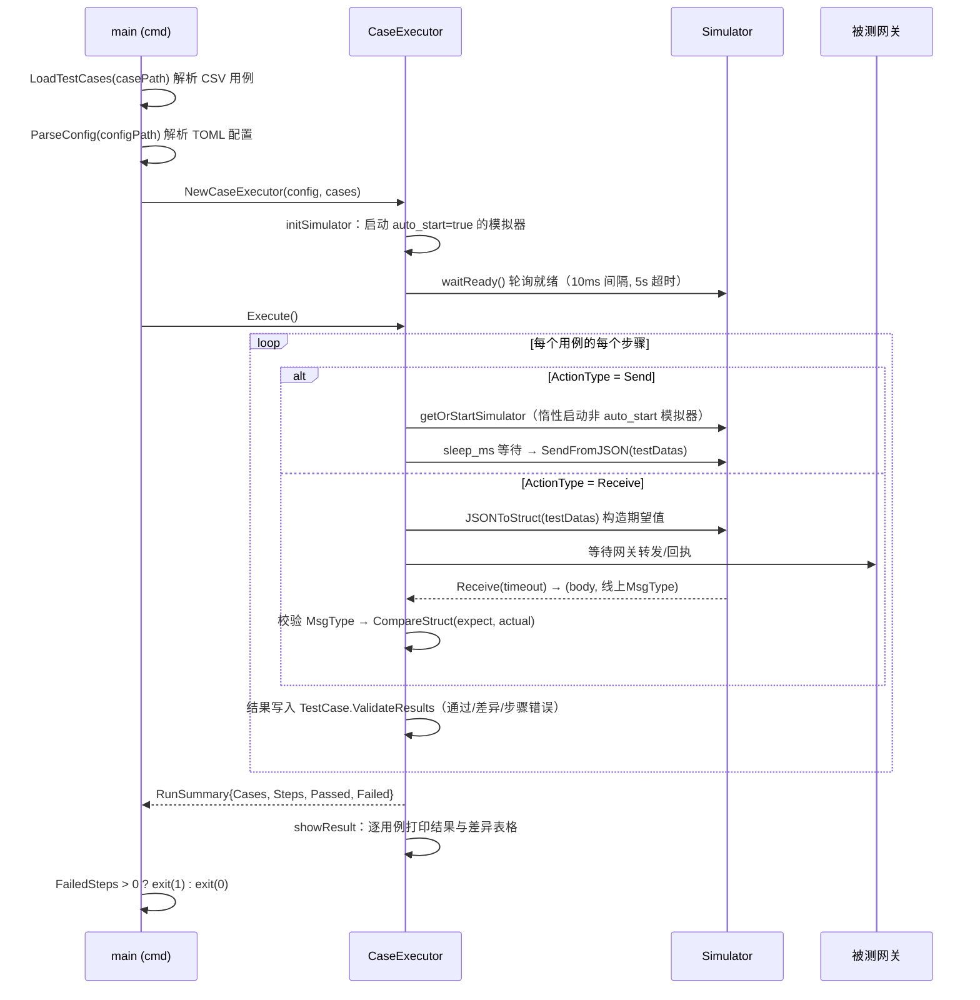

# GT-Auto 架构文档

> 更新日期：2026-10-06。本文档描述代码现状；配套的[开发设计文档](design.md)记录设计决策、格式规范与扩展指南。

## 1. 项目定位

GT-Auto 是金融交易系统的**网关自动化测试工具**：用可编程的模拟器替代真实的 OMS（订单管理系统）与 TGW（交易网关/交易所前置），对夹在中间的**被测网关**做黑盒报文级验证。

测试拓扑：



工具本身不实现业务逻辑，只负责：**按 CSV 用例收发指定协议的二进制报文 → 将收到的报文与期望数据逐字段比对 → 输出差异报告与进程退出码**。

## 2. 分层总览



| 包 | 职责 | 关键类型 |
|---|---|---|
| `cmd/gt-auto` | CLI 参数解析、初始化日志、调用执行器、根据结果设置退出码 | `main` |
| `pkg/executor` | 用例执行编排：模拟器生命周期、步骤分发、结果汇总 | `CaseExecutor`、`RunSummary` |
| `pkg/testcase` | 用例模型与 CSV 解析、测试数据加载与缓存 | `TestCase`、`TestStep`、`CSVCaseParser` |
| `pkg/tcp` | 协议无关的 TCP 模拟器（客户端/服务端），收发与缓冲 | `OmsSimulator[T]`、`TgwSimulator[T]`、`Simulator[T]` |
| `pkg/codec` | 协议相关：二进制编解码、TCP 分帧、协议工厂 | `MessageCodec`、`Framer`、`DefaultMessageCodecFactory` |
| `pkg/config` | TOML 配置解析 | `GwAutoConfig`、`SimulatorConfig` |
| `pkg/validate` | 期望值/实际值结构比对，差异表格输出 | `CompareStruct`、`CompareResult`、`RenderDiffTable` |

## 3. 核心接口

### 3.1 MessageCodec（协议编解码，`pkg/codec/message_codec.go`）

```go
type MessageCodec interface {
    ProtoName() string
    EncodeJSONMap(map[string]interface{}) ([]byte, error)          // JSON map -> 线上字节（发送路径）
    JSONToStruct(map[string]interface{}) (codec.BinaryCodec, error) // JSON map -> 报文结构体（期望值构造）
    Encode(msgType uint32, message codec.BinaryCodec) ([]byte, error)
    Decode([]byte) (interface{}, codec.BinaryCodec, error)          // 字节 -> (msgType, body)
}
```

三个实现，与协议一一对应（均为无状态结构体，并发安全）：

| 实现 | `ProtoName` | 常量 | 说明 |
|---|---|---|---|
| `BinaryRiskMessageCodec` | binary-risk | `BinaryRisk` | 风控二进制协议 |
| `BinarySzseMessageCodec` | binary-szse | `BinarySZSE` | 深交所二进制协议；`JSONToStruct` 会按 `ApplID` 附加扩展结构 `ApplExtend` |
| `BinarySseMessageCodec` | binary-sse | `BinarySSE` | 上交所二进制协议 |

`MsgType` 的解析统一走 `msgTypeFromMap`：要求 map 中存在字符串类型的 `MsgType` 且可转为数字，否则返回错误（不 panic）。

map → 结构体转换由 `ConvertMapToStruct` 完成：按 `json` tag（缺省用字段名）匹配、支持 string/int/uint/bool 及嵌套 struct 的类型转换，多余字段忽略。报文结构体来自外部依赖 `fin-proto-*-bin-go`（代码生成，字段全导出）。

### 3.2 Framer（TCP 分帧，`pkg/codec/*_framer.go`）

```go
type Framer interface {
    ProtoName() string
    ReadFrame(conn net.Conn) ([]byte, error) // 读一个完整帧（头+体），io.ReadFull 保证读满
}
```

与 codec 一一对应：`RiskBinFramer` / `SzseBinFramer` / `SseBinFramer`。帧格式见 [§6 协议帧格式](#6-协议帧格式)。

### 3.3 Simulator（协议无关模拟器，`pkg/tcp/tcp_simulator.go`）

```go
type Simulator[T fin_codec.BinaryCodec] interface {
    Start() error
    Ready() bool                                            // OMS: 已拨号; TGW: listener 已绑定
    Send(msgType uint32, message fin_codec.BinaryCodec) error
    SendFromJSON(message map[string]interface{}) error       // JSON map -> 编码 -> 发送
    Receive(timeout time.Duration) (T, uint32, error)        // 取一条消息, 返回 (body, 线上MsgType)
    GetCodec() codec.MessageCodec
    Close() error
}
```

- `OmsSimulator[T]`：**客户端**。`Start` 同步 `DialTimeout`（5s），成功后启动 `receiveLoop` goroutine 持续读帧入队。`Send` 直接写连接。
- `TgwSimulator[T]`：**服务端**。`Start` 绑定 listener 后进入 accept 循环（阻塞，需在 goroutine 中启动）；每接受一个连接起一个 `handleClient` goroutine 读帧入队；`Send` 发往**最近接受的连接**（`conn` 字段，`connMu` 保护）。

两个实现共享同一套缓冲设计：

```go
type receivedMessage struct {          // 队列元素：报文体 + 线上消息类型
    MsgType uint32
    Body    fin_codec.BinaryCodec
}
queue chan receivedMessage  // 容量 receiveQueueCapacity = 1024, 构造时创建, 之后不可变
```

`Receive` 通过 `select` + `time.Timer` 实现超时（默认 5s，可配置），杜绝静默网关导致的永久阻塞。

### 3.4 CaseParser（用例解析，`pkg/testcase`）

```go
type CaseParser interface {
    Parse() ([]*TestCase, error)
}
```

当前有两个实现，`LoadTestCases` 按扩展名分发：`CSVCaseParser`（`.csv`，测试数据放在同目录的独立 sheet 文件中）与 `JSONCaseParser`（`.json`，测试数据内联在每个步骤的 `testData` 对象中）；Excel 格式待实现（见设计文档 §5.3）。

## 4. 执行流程



关键语义：

- **模拟器生命周期**：`auto_start = true`（典型为 tgw）在 `initSimulator` 预启动并等待就绪；`auto_start = false`（典型为 oms）在步骤首次引用时由 `getOrStartSimulator` 惰性启动。就绪 = OMS 完成拨号 / TGW 完成 listener 绑定。
- **Send 步骤**：`TestDatas` 注入 `MsgType` 后整体交给 codec 编码发送；发送失败记录为步骤错误。
- **Receive 步骤**：先用同一份 `TestDatas` 构造**期望值**（假设网关原样转发/回执），再从队列取实际报文；线上 `MsgType` 与步骤期望不符 → 步骤失败并给出 `received MsgType X, expected Y`；`VerifyRequired = Y` 时执行字段级比对。
- **失败语义**（防“假通过”）：所有无法执行的步骤（模拟器缺失/创建失败、发送失败、接收超时、MsgType 不符、未知 ActionType）都通过 `TestCase.AddStepError` 记录为失败结果，`StepValidateResult.Error` 携带原因。

## 5. 并发模型

| goroutine | 归属 | 生命周期 |
|---|---|---|
| `receiveLoop` | OmsSimulator | `Start` 成拨号后启动；连接关闭（EOF/ErrClosed）即退出 |
| accept 循环 | TgwSimulator | `Start` 进入，`Close` 关 listener 后退出 |
| `handleClient` | TgwSimulator | 每连接一个；读帧失败（断连/错位）即退出并关连接 |
| stop watcher | TgwSimulator | `Start` 启动，`stopChan` 关闭时关 listener |

同步设施：

- `OmsSimulator.connMu`：保护 `conn`（Start 写 / Send、Close 读）。
- `TgwSimulator.stopMu`：保护 `listener`、`stopChan`（Start 写 / Ready、Close 读写）；`Close` 幂等（未 Start、重复调用均安全）。
- `TgwSimulator.connMu`：保护最近接受的 `conn`（accept 写 / Send、Close 读写）。
- 接收队列 `chan receivedMessage`：构造时创建、之后只读使用，天然无竞争。
- executor 与模拟器之间用 **就绪轮询**（`waitReady`，10ms 间隔 / 5s 超时）同步，不依赖 `time.Sleep`。

全部测试在 `go test -race` 下运行；历史修复中 race detector 多次抓出真实竞争，是本项目的常规验证手段。

## 6. 协议帧格式

所有多字节字段均为**大端**。`BodyLength` 字段由编码器回填真实长度。

| 协议 | 头部 | 体 | 尾部 | Framer 读取逻辑 |
|---|---|---|---|---|
| binary-szse | `MsgType`(4) + `BodyLength`(4) | 报文体 | `Checksum`(4, int32) | 头 8B，体长 = BodyLength + 4（含校验和） |
| binary-sse | `MsgType`(4) + `MsgSeqNum`(8) + `MsgBodyLen`(4) | 报文体 | `Checksum`(4, uint32) | 头 16B，体长 = MsgBodyLen + 4 |
| binary-risk | `MsgType`(4) + `Version`(4) + `MsgBodyLen`(4) | 报文体 | 无 | 头 12B，体长 = MsgBodyLen |

报文结构体（`NewOrder`、`OrderConfirm`、`ExecutionConfirm` 等）与 `MsgType` 注册表均由 `fin-proto-*-bin-go` 系列库提供（代码生成，`NewSzseBinaryMessageByMsgType` 等）。

## 7. 结果与退出码

- 每个步骤产生一条 `StepValidateResult`：`Passed`（比对通过）、`Detail`（`CompareResult`：字段级 `Diffs` + 文本 `DiffInfo`）、`Error`（步骤无法执行的原因）。
- `showResult` 逐用例输出：✅ 通过 / ❌ 比对差异（表格：Path/Expected/Actual）/ ❌ 步骤错误（原因）。
- `--report` 参数控制 JSON 报告落盘（默认 `gt-auto-report.json`，传空禁用）：包含运行起止时间/耗时、汇总计数、每个用例下每条步骤结果（通过、执行错误原因、字段级差异），供归档与 CI 产物上传。
- `RunSummary{TotalCases, TotalSteps, PassedSteps, FailedSteps}` 打印到日志；`FailedSteps > 0` 时进程以 **exit code 1** 结束，CI 可直接判定结果。
- 配置/用例加载失败：错误经 cli 输出并以非零码退出（不 panic）。

## 8. 依赖

| 依赖 | 用途 |
|---|---|
| `fin-proto-runtime-bin-go` | 二进制编解码基础库（`BinaryCodec`、`WriteBasicType` 等） |
| `fin-proto-szse-bin-go` / `fin-proto-sse-bin-go` / `fin-proto-risk-bin-go` | 各交易所/风控协议的报文结构与 MsgType 注册表 |
| `BurntSushi/toml` | 配置解析 |
| `google/go-cmp` | 结构比对（自定义 `DiffReporter` 收集字段级差异） |
| `urfave/cli/v2` | CLI 框架 |
| `sirupsen/logrus` | 日志 |
| `olekukonko/tablewriter` | 差异表格输出 |
| `stretchr/testify` | 测试断言 |

## 9. 目录结构

```
gt-auto/
├── cmd/gt-auto/            # CLI 入口
├── pkg/
│   ├── codec/              # 协议编解码 + 分帧 + 工厂
│   │   ├── message_codec.go        # MessageCodec 接口 / msgTypeFromMap / ConvertMapToStruct
│   │   ├── message_codec_factory.go# 工厂（协议 -> codec/framer）
│   │   ├── {risk,szse,sse}_message_codec.go
│   │   ├── {risk,szse,sse}_bin_framer.go
│   │   └── testdata / *_test.go
│   ├── config/             # TOML 配置（含 testdata 示例）
│   ├── executor/           # 用例执行编排
│   ├── tcp/                # OMS/TGW 模拟器
│   ├── testcase/           # 用例模型 + CSV 解析（含 testdata 用例）
│   └── validate/           # 结构比对
├── docs/                   # 本文档
├── Makefile                # build / install / run / test
└── readme.md
```
