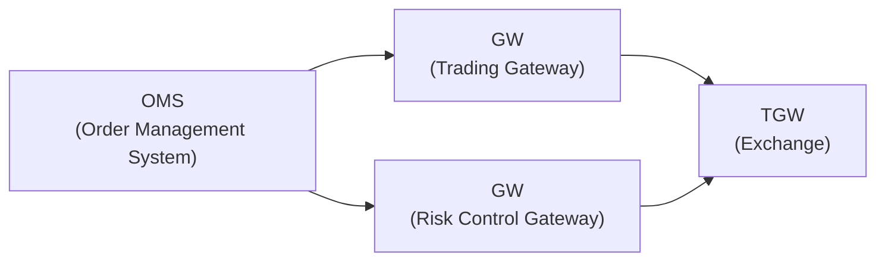
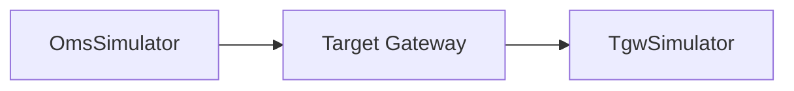
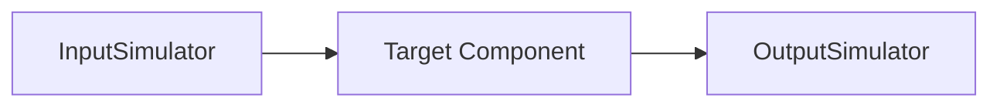

[简体中文](readme.md) | [English](readme-en.md)

# GT-Auto

GT-Auto is a gateway auto test tool designed for financial trading systems. It provides a framework for automating the testing of message exchanges between an Order Management System (OMS) and a Trading Gateway (TGW).

Scriptable simulators replace the real OMS and exchange side, so the gateway under test can be verified black-box at the message level: test cases drive the simulators to exchange real protocol frames with the gateway, and every response is compared field by field against expectations.

## Features
- **Protocol simulators**: an OMS-side TCP client and a TGW-side TCP server, currently speaking the risk-control, SZSE and SSE binary protocols.
- **Multi-format test cases**: drive flows (send order -> receive confirm -> verify) from CSV, Excel (.xlsx) or JSON - no code required.
- **Field-level validation**: expected vs. actual messages are compared with go-cmp; differences are rendered as a table (path / expected / actual).
- **Trustworthy results**: every step failure - simulator unavailable, receive timeout, unexpected message type, bad test data - is recorded and fails the run with a non-zero exit code, so CI can judge the outcome directly; a structured report (JSON/HTML, with summary, step results and field-level diffs) is written after every run.
- **Robust by design**: disconnects, silent gateways and malformed inputs produce clear errors instead of panics or hangs; the whole test suite runs under `-race`.

## Documentation
- [Architecture (架构文档)](docs/architecture.md) – layered design, core interfaces, execution flow, concurrency model, wire frame formats
- [Design & Development (开发设计文档)](docs/design.md) – design decisions (ADR), test case/config format specs, extension guides, testing strategy, roadmap

## Quick Start

Prerequisite: Go 1.25+.

```bash
make build    # builds bin/gt-auto
make test     # go test ./... (run with -race in CI)
```

Run a test case (see the shipped samples under `pkg/testcase/testdata/` and `pkg/config/testdata/`):

```bash
./bin/gt-auto \
  --casePath pkg/testcase/testdata/risk_test_case.csv \
  --config   pkg/config/testdata/gw-auto-risk.toml
# exit code 0 = all steps passed; 1 = at least one step failed
# reports are written after the run: --report picks the format by extension
# (JSON/HTML) and may be repeated (default gt-auto-report.json, empty disables)
```

A test case CSV orchestrates steps against simulators defined in the TOML config. A typical flow is four steps: OMS sends a new order, TGW receives and verifies it, TGW sends the confirmation, OMS receives and verifies it. See the [design doc](docs/design.md) for the full format spec.

## Architecture

- Production environment:

- Test environment (this tool replaces OMS and TGW):

- Generic input/output view:


## Supported Protocol Types
- [x] **RiskBin** - Risk Control Binary Protocol, used for high-speed risk control data exchange.
- [x] **SzseBin** – Shenzhen Stock Exchange Binary Protocol, used for high-speed market data or trading access.
- [ ] **SzseStep** – Shenzhen Stock Exchange STEP Protocol, supports richer session and order interaction.
- [x] **SseBin** – Shanghai Stock Exchange Binary Protocol, similar to SzseBin, used for trading and data exchange.
- [ ] **SseStep** – Shanghai Stock Exchange STEP Protocol, provides comprehensive support for order and execution data.
- [ ] **FIX** (Financial Information eXchange) – Widely used international standard for communication between traders, brokers, and exchanges.
- [ ] **IMIX** (Inter-bank Market Information eXchange) – Protocol for communication between financial institutions in interbank markets.
- [ ] **Protobuf** – Google Protocol Buffers used for efficient service-to-service communication.
- [ ] **Custom** – User-defined protocol (binary or text-based), tailored for specific business needs.

## Development
- `make build` / `make install` – build the binary (into `bin/`, or copy to `~/go/bin`).
- `make run` – run the three shipped sample cases (risk / sse / szse).
- `make test` – run the unit and integration tests; use `go test ./... -race` locally before submitting changes.
- New protocols only need a codec + framer registered in the factory - see the [extension guide](docs/design.md#5-扩展指南).

## License
[MIT](LICENSE)

[](https://deepwiki.com/xinchentechnote/gt-auto)
