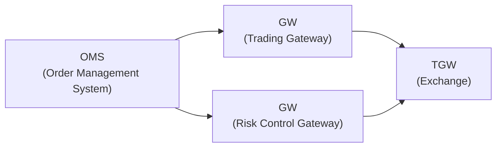
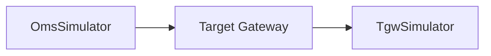
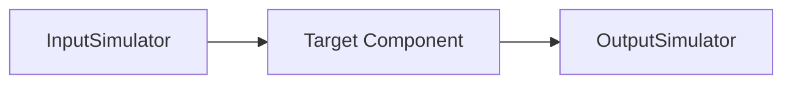

## Overview
GT-Auto is a gateway auto test tool designed for financial trading systems. It provides a framework for automating the testing of message exchanges between an Order Management System (OMS) and a Trading Gateway (TGW).
- Here is the system architecture diagram for the production environment:

- System architecture diagram for the test environment:

- System architecture diagram for the test environment with a focus on the input and output components:

##  Supported Protocol Types

- [x] **SzseBin** – Shenzhen Stock Exchange Binary Protocol, used for high-speed market data or trading access.
- [ ] **SzseStep** – Shenzhen Stock Exchange STEP Protocol, supports richer session and order interaction.
- [ ] **SseBin** – Shanghai Stock Exchange Binary Protocol, similar to SzseBin, used for trading and data exchange.
- [ ] **SseStep** – Shanghai Stock Exchange STEP Protocol, provides comprehensive support for order and execution data.
- [ ] **FIX** (Financial Information eXchange) – Widely used international standard for communication between traders, brokers, and exchanges.
- [ ] **IMIX** (Inter-bank Market Information eXchange) – Protocol for communication between financial institutions in interbank markets.
- [ ] **Protobuf** – Google Protocol Buffers used for efficient service-to-service communication.
- [ ] **Custom** – User-defined protocol (binary or text-based), tailored for specific business needs.

