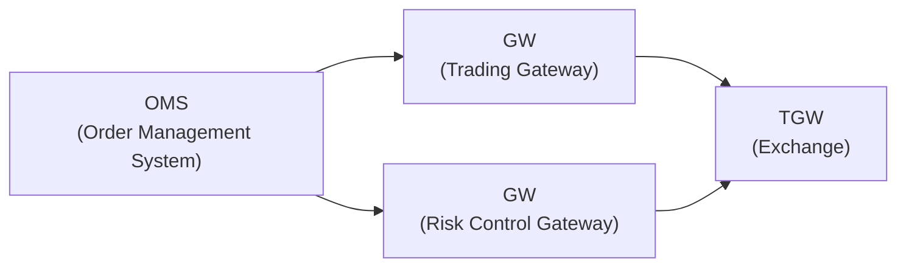
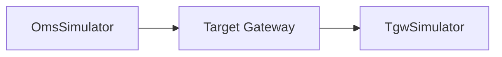
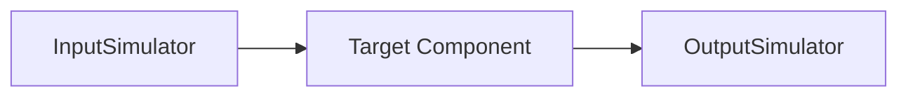

[简体中文](readme.md) | [English](readme-en.md)

# GT-Auto

GT-Auto 是面向金融交易系统的网关自动化测试工具，用于自动化验证订单管理系统（OMS）与交易网关（TGW）之间的报文交互。

工具用可编程的模拟器替代真实的 OMS 与交易所侧，对**被测网关**做消息级黑盒验证：测试用例驱动模拟器与网关收发真实协议报文，并将每个回包与期望值逐字段比对。

## 特性

- **协议模拟器**：OMS 侧 TCP 客户端 + TGW 侧 TCP 服务端，当前支持风控、深交所、上交所三种二进制协议。
- **CSV 用例驱动**：无需写代码即可编排多步报文流程（发单 → 收回执 → 校验）。
- **字段级校验**：基于 go-cmp 的期望值/实际值比对，差异以表格（路径 / 期望 / 实际）输出。
- **结果可信**：所有步骤失败——模拟器不可用、接收超时、回包类型不符、用例数据错误——均计入失败并以非零退出码结束，CI 可直接判定结果。
- **健壮性**：连接断开、网关静默、坏数据都会产生明确错误而不是 panic 或卡死；全部测试在 `-race` 下运行。

## 文档

- [架构文档](docs/architecture.md) – 分层设计、核心接口、执行流程、并发模型、协议帧格式
- [开发设计文档](docs/design.md) – 设计决策（ADR）、用例/配置格式规范、扩展指南、测试策略、路线图

## 快速开始

依赖：Go 1.25+。

```bash
make build    # 构建到 bin/gt-auto
make test     # 运行全部单测与集成测试（CI 中建议加 -race）
```

运行用例（示例用例与配置见 `pkg/testcase/testdata/` 与 `pkg/config/testdata/`）：

```bash
./bin/gt-auto \
  --casePath pkg/testcase/testdata/risk_test_case.csv \
  --config   pkg/config/testdata/gw-auto-risk.toml
# 退出码 0 = 全部步骤通过；1 = 存在失败步骤
```

用例 CSV 按步骤驱动配置中定义的模拟器，典型流程为四步：OMS 发单 → TGW 收单并校验 → TGW 发确认 → OMS 收确认并校验。完整格式规范见[开发设计文档](docs/design.md#3-测试用例格式规范)。

## 架构

- 生产环境：

```mermaid
graph LR
    OMS["OMS<br>(Order Management System)"]
    GW1["GW<br>(Trading Gateway)"]
    GW2["GW<br>(Risk Control Gateway)"]
    TGW["TGW<br>(Exchange)"]

    OMS --> GW1
    OMS --> GW2
    GW1 --> TGW
    GW2 --> TGW
```
- 测试环境（本工具替代 OMS 与 TGW）：

```mermaid
graph LR
    OMS[OmsSimulator]
    GW[Target Gateway]
    TGW[TgwSimulator]

    OMS --> GW
    GW --> TGW
```
- 通用输入/输出视角：

```mermaid
graph LR
    Input[InputSimulator]
    Component[Target Component]
    Output[OutputSimulator]

    Input --> Component
    Component --> Output
```

## 支持的协议类型

- [x] **RiskBin** – 风控二进制协议，用于高速风控数据交换。
- [x] **SzseBin** – 深交所二进制协议，用于高速行情或交易接入。
- [ ] **SzseStep** – 深交所 STEP 协议，支持更丰富的会话与订单交互。
- [x] **SseBin** – 上交所二进制协议，与 SzseBin 类似，用于交易与数据交换。
- [ ] **SseStep** – 上交所 STEP 协议，全面支持订单与成交数据。
- [ ] **FIX** – 国际通行的金融报文交换标准。
- [ ] **IMIX** – 银行间市场报文交换协议。
- [ ] **Protobuf** – Google Protocol Buffers 序列化协议。
- [ ] **Custom** – 用户自定义协议（二进制或文本）。

## 开发

- `make build` / `make install` – 构建二进制（输出到 `bin/`，或复制到 `~/go/bin`）。
- `make run` – 依次运行 risk / sse / szse 三个示例用例。
- `make test` – 运行单测与集成测试；提交改动前建议本地执行 `go test ./... -race`。
- 新增协议只需实现 codec + framer 并在工厂注册，执行编排与模拟器零改动，参见[扩展指南](docs/design.md#5-扩展指南)。

## License

[MIT](LICENSE)

[](https://deepwiki.com/xinchentechnote/gt-auto)
